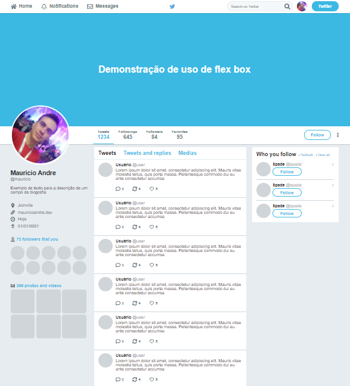

<h1 align="center">
  demoFlexBox
</h1>

<h2 align="center">
  Uma demonstração prática do uso dos recursos do flexBox
</h2>

  <a href="#sobre-o-projeto">Sobre o projeto</a>&nbsp;&nbsp;&nbsp;|&nbsp;&nbsp;&nbsp;
  <a href="#get-started">Get Started</a>&nbsp;&nbsp;&nbsp;|&nbsp;&nbsp;&nbsp;
  <a href="#licença">Licença</a>

---

## Sobre o projeto
Esse projeto é uma demonstração simples das possibilidades que o flexBox proporciona. Como inspiração para sua criação, a interface do Tweeter foi usada como exemplo, esse portanto é um clone de sua interface. O resultado final do projeto é demonstrado no print abaixo.

  

## Get Started

Basta baixar o projeto e abrir o arquivo [index.html](./index.html) em seu navegador;

## Licença
Esse projeto está sob licença MIT, veja o arquivo de [LICENSE](./LICENSE) para mais detalhes

___
By Mauricio Redmerski André
